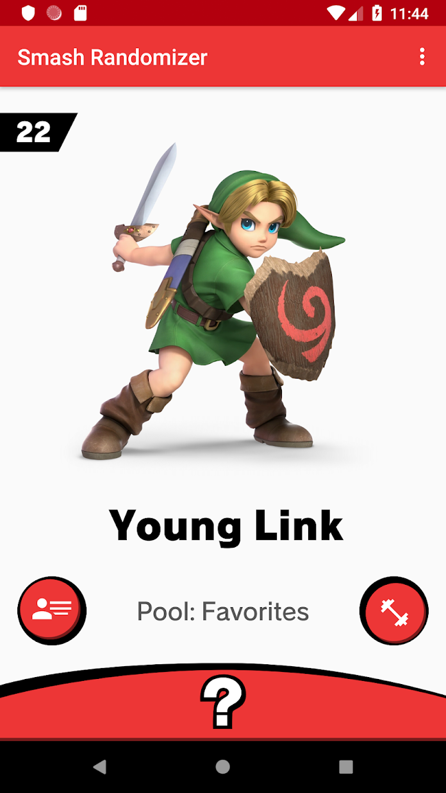
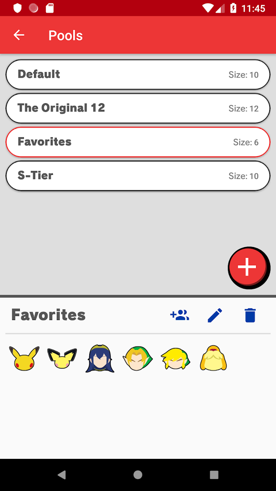
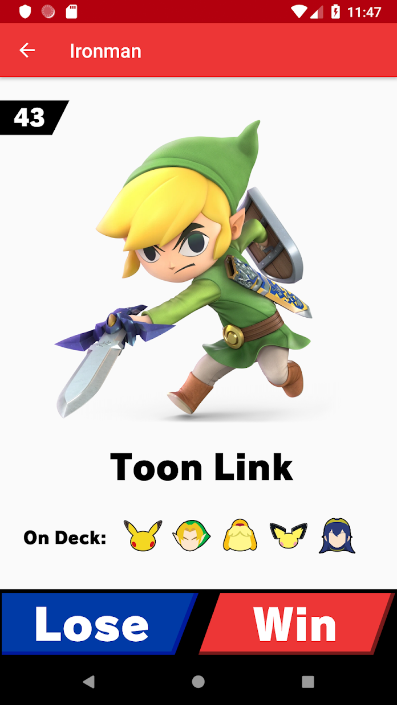

# App Suspended 

This app has been suspended from the Google Play Store. Please see [here](app_suspended.md) for details. In all likelihood this app will
not be available on Google Play and may no longer receive updates. Sorry for the inconvenience. 

---

# SmashRandomizer

  
  

### About ###
Smash Randomizer gives you control over choosing a random character in Super Smash Bros. Ultimate. With this app, you can create a pool of characters you are interested in playing and then get a random character from that pool.

**Features:** 
- Get a random character in one tap
- Create multiple pools and quickly switch between them
- Run through your pool in an ironman

  
  
  

     

**Legal**
This app has no association with Nintendo or Super Smash Bros. Ultimate. All character portraits, character icons, and fonts are the sole property of their respective owners. This app is completely free and was created for educational purposes. 
