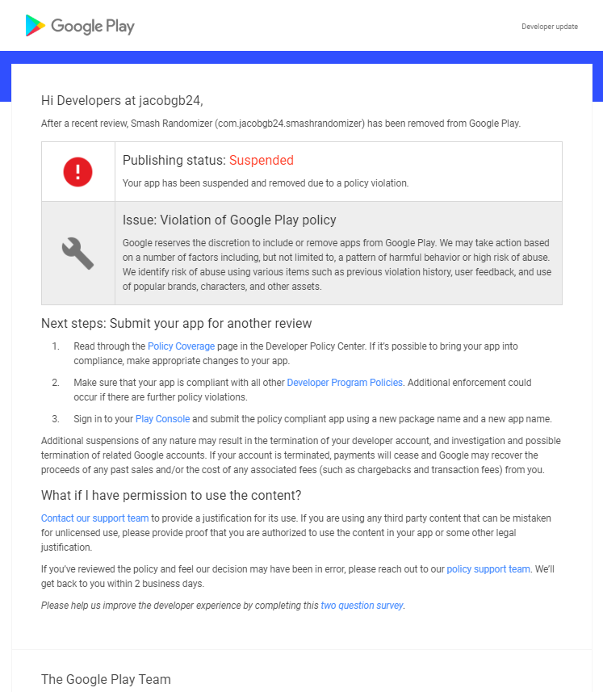

### Initial Notification

_I received this email after updating the "app content" section on the play store listing. This is a new and required section stating 
the target age. While I had just added Hero a few weeks ago without issue, this change to the app's listing (not the app itself) 
caused the app to be auto-flagged and removed._

_While this surprised me, the reasoning somewhat made sense. The application does heavily use copy-righted content. However, I believe it
is within fair use since the app makes no profit, and does not detract from the value of Smash Bros. In fact, it increases the game's 
value by acting as a companion. So I made the following appeal statement:_

---

### Appeal

> The stated issue was a violation of the google play policy. It includes this line: “ We identify risk of abuse using various items such as ... use of popular brands, characters, and other assets.” My app does use popular characters from Super Smash Brothers; however, I do not believe I have any risk of abuse. The app is completely free and open source. There are no in-app purchases or ads. The app doesn’t even use the internet outside of firebase crash reports. I do not see how this app could have any kind of abuse. 
>  
> After reviewing the google play policies, the only violation I could see is intellectual property infringement. While the app is focused on Super Smash Brothers, I believe it is within fair use. This is because the app serves as a companion to the game. There is no use for the app unless one owns the game and thus it does not detract from the potential market of the game. The app also makes no profit from the use of the characters. 

_I felt this sufficiently made my argument given the character limitation. It clearly outlined my reasoning of having copyright content
and addressed the possibility of my app being "high risk"_

---

### Response

> Hi Jacob,
> 
> Thanks for contacting the Google Play team.
> 
> Status of app Smash Randomizer (com.jacobgb24.smashrandomizer): Suspended from Google Play due to policy violation
> 
> We’ve reviewed your appeal request and found that your app violates Google Play policy.
>
> We’ve determined your app to be a high risk profile. Google Play identifies high risk profiles by using signals such as:
> 
> * apps that contain assets prone to abuse
> * previous app enforcements
> * relations to other previously suspended apps or accounts
> * user rating and uninstall data
> You can read through the [Policy Coverage](https://play.google.com/about/enforcement/policy-coverage/) page for more details.
> 
> If your developer credentials are still in good standing with Google Play and your app allows for it, you can publish a new compliant version of the app by following these steps:
> 
> 1. Make the necessary changes to your app to address the signals described above, if possible.
> 2. Double check that your app complies with all other [Developer Program Policies](https://play.google.com/about/developer-content-policy/). Additional enforcement could occur if there are further policy violations.
> 3. Sign in to your Play Console and upload a new app using a new package name and a new app name.
> Please let me know if you have any other questions. Thanks for your continued support of Google Play.
> 
> Regards,
> Mika
> The Google Play Team
> Please visit the Play Developer Policy Center and Play Academy to learn more about building policy compliant and high quality apps. 

_This was a pretty empty response, although I feared as much given the many horror stories about Google Play. I hoped to be able to get
a few more details since this mostly just restated the initial email and provided links. It also seemed as if my appeal statement was
not read or considered at all._

---

### Follow Up Emails

**From Me**
> Hi Mika,
> 
> I feel that I addressed the policy coverage page you linked to in my original appeal. In addition, I do not think the 4 points above are applicable, with the exception of the assets which I justified in my appeal. In the odd case that my appeal statement did not get included, here it is:
>
> {verbatim copy & paste of original appeal statement omitted for brevity}
> 
> Could you please provide a specific example of how my application violates policies or how my justifications above are insufficient? I also don't see how I could remove the assets I use if I were to republish the app since they are fundamental to its design. 
> I'm confused how the app could pass initial review and a recent update, but suddenly be suspended for updating the content rating.
> 
> Thanks for your help,
> Jacob

**Response**

> Hi Jacob,
> 
> Thanks again for contacting Google Play team.
> 
> As much as I'd like to help, I’m not able to provide any more information or a better answer to your question. In our previous email, I made sure to include all the information available to me.
> 
> You should be able to find more information about your issue here: Policy Coverage page
> 
> If you have a different question, please let me know.

_So at this point, it's clear I'm not getting anywhere, but out of frustration I tried pushing back one more time, hoping to get
a concrete answer._

**From Me**

> Hi Mika,
> 
> One last question. If you aren't able to clarify the reason for my app being suspended or you don't have the power to undo the suspension based on my appeal, can this be escalated to someone that can?
> 
> In general, I'm not really sure how to proceed. All the steps I see say to fix the violations then republish as a new app. But I don't think the current app violates any policies, and if it does I'm not sure in what way. So I don't know what I'd need to change if I were to republish. 
> 
> Thanks,
> Jacob

_At this point, I was replied to with a survey asking how support did and telling me to email them again if I wasn't satisfied. I
was busy preparing for school so I didn't get around to handling this for a week or so. Eventually I resent the email above asking for 
an answer._

**Response**

> Hi Jacob,
> 
> Thanks for your reply.
> 
> First of all, you are not able to escalate your app to other team. 
> 
> And in our previous email, I've included all the information about violation for your app. Please check our email for your understanding. 
> 
> If your developer credentials are still in good standing with Google Play and your app allows for it, you can publish a new compliant version of the app by using **a new package name and a new app name.**
> 
> Thanks for your support 

**From Me**

> Yes, I've read everything you've supplied including the bold statement in your previous email.
> 
> The issue is that I do not see how my app violates any policy that you have provided. Therefore, I cannot create a "new compliant version of the app" because I don't know how my current app is non-compliant. 
> On the "policy coverage" page it specifically says that "we’re committed to ensuring developers understand how they can bring their app into compliance", yet I haven't received any clear guidance on how to bring my app into compliance. 
> 
> I also still don't understand how my app was not in violation when updated a few weeks prior, but setting the content rating suddenly flagged it. This just further adds to the confusion because it shows my app did not violate any policies (otherwise the update would've been blocked), and nothing has changed in my application since that point.

_So this is where it is currently at. I think the email chain paints a clear enough picture. I'm not sure how to proceed at this point,
but in all likelihood, the app is dead. If I have time I can look into using F-Droid or APK Mirror for distribution. Sorry to everyone
using the app._
